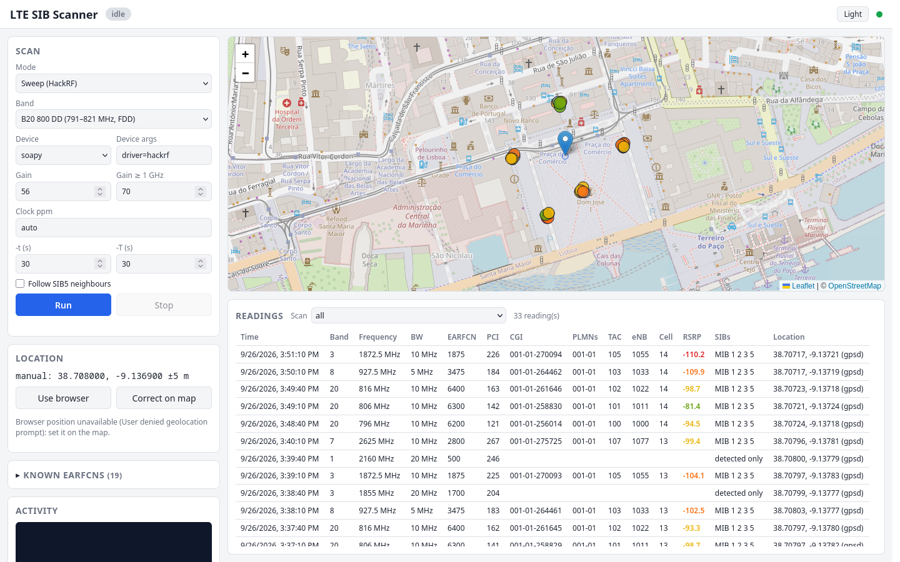

# LTE cell scanner and MIB/SIB parser

Passively finds LTE cells and decodes their broadcast system information
(MIB, SIB1–SIB13) with an SDR, storing everything in SQLite. It combines
srsRAN's `cell_search` with a patched, **receive-only** `srsue`.

This is a fork of [godfuzz3r/lte-sib-parser](https://github.com/godfuzz3r/lte-sib-parser)
that adds HackRF One support, fixes srsue transmitting, adds a sweep-based
scan mode with automatic clock calibration, a readings database with location
and cell identity, and a local [web app](#web-app) with a live map. Every
change is listed in
[Changes and design decisions](#changes-and-design-decisions).


*The web app ([below](#web-app)), with fictitious demo data.*

> **srsue never transmits.** `worker/rx_only.patch` turns srsue's radio TX
> functions into no-ops. The upstream project relied on `sib_logger.patch` for
> this, but that patch only changes log levels: srsue would attempt an RRC
> connection (PRACH) through the SDR's TX port.

## How it works

`vol/sib-scan.sh` drives the scan:

1. **Find a cell**
   - default: `cell_search` walks the band EARFCN by EARFCN until it finds a cell;
   - `-K "e1 e2 …"` (HackRF): a list of known EARFCNs is checked for cells with
     PSS/SSS, and EARFCNs advertised in SIB5 are added (see [Known EARFCNs](#known-earfcns));
   - `-S` (HackRF): `hackrf_sweep` measures the whole band, LTE carriers are
     found in the spectrum and their exact EARFCN is confirmed with PSS/SSS;
   - `-q "e1 e2 …"`: an explicit list of EARFCNs.
2. **Decode**: srsue is started on the EARFCN and `parse_save_sib.py` reads
   its log, saving MIB, RSRP and SIBs to SQLite (see [Timeouts](#timeouts)):
   one row per EARFCN in `cells.sqlite`, and one row per reading, with
   location, CGI and PCI, in `readings.sqlite` (see [Readings database](#readings-database)).
3. **Follow neighbours**: EARFCNs listed in SIB5 are scanned the same way,
   recursively (disable with `-n`).
4. With `cell_search`, the band search resumes where it stopped until the
   end of the range.

## Supported SDRs

| SDR | Status | Notes |
|---|---|---|
| LimeSDR Mini / USB | tested upstream | `-d soapy -a "rxant=LNAW"` |
| HackRF One | tested in this fork (B20, B3) | `-d soapy -a "driver=hackrf"`, see [HackRF usage](#hackrf-usage) |
| RTL-SDR | not usable for SIBs | ≤2.4 MSPS: not enough for any LTE cell's SIBs |
| USRP (and B210 clones) | should work (srsRAN supports it) | see [USRP clones](#usrp-clones) |
| bladeRF 2.0 micro | tested in this fork (xA5, firmware v2.6.0, FPGA v0.16.0) | `-d bladeRF`, decodes 20 MHz cells, see [bladeRF usage](#bladerf-usage) |
| bladeRF (1st gen, x40/x115) | should work (same srsRAN plugin) | not tested |

## Installation

Everything (drivers, srsRAN, Python) runs inside a Docker image. The host
needs Docker with the compose plugin, git, and access to the SDR over USB.

### Docker, compose and git

Tested on Arch Linux. The other commands use each distribution's standard
packages and were not tested with this project.

**Arch Linux / Manjaro**
```bash
sudo pacman -S docker docker-compose docker-buildx git
```

**Ubuntu 22.04 / 24.04**
```bash
sudo apt update
sudo apt install docker.io docker-compose-v2 git
```

**Debian 12**: Debian's own `docker-compose` package is the old v1, so use
Docker's repository: follow <https://docs.docker.com/engine/install/debian/>
(installs `docker-ce` and `docker-compose-plugin`), then:
```bash
sudo apt install git
```

**Fedora**
```bash
sudo dnf install moby-engine docker-compose git
```
(or Docker's own packages: <https://docs.docker.com/engine/install/fedora/>)

**openSUSE Tumbleweed / Leap**
```bash
sudo zypper install docker docker-compose git
```

Then, on every distribution, start Docker and allow your user to use it:
```bash
sudo systemctl enable --now docker
sudo usermod -aG docker $USER
```
Log out and back in (or reboot) so the `docker` group applies to all your
programs; `newgrp docker` only applies to the current terminal.

### Optional host tools

Not needed to run the project (the image has them), but handy to check that
the SDR is seen by the host:

| Distribution | Command |
|---|---|
| Arch | `sudo pacman -S hackrf usbutils` |
| Ubuntu / Debian | `sudo apt install hackrf usbutils` |
| Fedora | `sudo dnf install hackrf usbutils` |
| openSUSE | `sudo zypper install hackrf usbutils` |

```bash
lsusb            # the SDR should be listed
hackrf_info      # HackRF only
```

### GPS receiver (optional)

With a GPS receiver and `gpsd` on the host, every reading gets a GPS position;
otherwise the web app uses the browser's position or one set on the map (see
[Location](#location)).

| Distribution | Command |
|---|---|
| Arch | `sudo pacman -S gpsd` |
| Ubuntu / Debian | `sudo apt install gpsd gpsd-clients` |
| Fedora | `sudo dnf install gpsd gpsd-clients` |
| openSUSE | `sudo zypper install gpsd` |

Point gpsd at the receiver (often `/dev/ttyACM0` or `/dev/ttyUSB0`): on
Debian/Ubuntu set `DEVICES="/dev/ttyACM0"` in `/etc/default/gpsd`, on other
distributions in `/etc/gpsd` or `/etc/sysconfig/gpsd`. Then:
```bash
sudo systemctl enable --now gpsd
gpspipe -w -n 10 | grep TPV      # should show "mode":2 or 3 with lat/lon
```
gpsd listens on `127.0.0.1:2947`; the container reaches it through the host
network.

### RTL-SDR dongles

The kernel's DVB-T driver grabs RTL2832 dongles; blacklist it so SDR software
can use them:
```bash
echo -e "blacklist dvb_usb_rtl28xxu\nblacklist rtl2832\nblacklist rtl2830" | sudo tee /etc/modprobe.d/blacklist-rtlsdr.conf
sudo modprobe -r dvb_usb_rtl28xxu rtl2832
```

## Build and run

```bash
git clone https://github.com/oicnanev/lte-sib-parser.git
cd lte-sib-parser
docker compose build        # compiles srsRAN, takes a while
```

Connect the SDR, then open a shell in the container (the `vol/` folder is
mounted at `/vol`):
```bash
docker compose run --rm worker
```
or with `./run.sh`, which also forwards the X11 socket and PulseAudio. Nothing
in the scan needs a GUI; if you need one, allow only the container's root user
with `xhost +SI:localuser:root` (see [decision 12](#changes-and-design-decisions)).

Inside the container:
```bash
./sib-scan.sh -h
./sib-scan.sh -d soapy -a "rxant=LNAW" -b 3                             # LimeSDR
./sib-scan.sh -S -p auto -d soapy -a "driver=hackrf" -g 56 -b 20        # HackRF
```

Results are written to `vol/output/` (ignored by git).

Or start the [web app](#web-app):
```bash
docker compose up webapp          # then open http://localhost:8080
```

## sib-scan.sh options

```
usage: sib-scan.sh [OPTION]...
  -h      show this help message
  -d      device name (UHD,soapy,bladeRF)
  -a      device args (example: "rxant=LNAW")
  -g      rx gain (default: 30)
  -G      rx gain for EARFCNs at 1 GHz and above (default: same as -g)
  -r      force srsue rf sample rate in Hz, srsue decimates in software
          (the ratio to the cell's sample rate must be an integer)
  -p      frequency correction in ppm for SDR clock error, positive
          tunes higher (e.g. a HackRF whose clock is 20 ppm slow: -p 20)
          -p auto measures it on the band's LTE cells (HackRF, needs -b)
  -b      lte band
  -s      start earfcn
  -e      end earfcn
  -S      find carriers with hackrf_sweep instead of cell_search (HackRF
          only, needs -b). With numpy the exact EARFCN is found with PSS/SSS,
          otherwise each carrier is tried on the 3 closest EARFCNs.
  -w      with -S: also run srsue on carriers >= 16 MHz wide (20 MHz cells).
          By default they are saved as detection-only readings (PCI and
          bandwidth, no SIBs): a HackRF (20 MSPS) cannot decode them
  -x      with -S: DL frequencies in MHz to skip, e.g. -x "796.0 806.0"
          (carriers already read in an overlapping band)
  -K      check a list of known EARFCNs for cells with PSS/SSS (HackRF,
          numpy), then run srsue only where there is one. EARFCNs advertised
          in SIB5 by the cells decoded are checked too. With -p auto the
          clock is measured in the same pass. Example: -K "6200 1875 2800"
  -W      with -K: EARFCNs known to be too wide for the SDR (20 MHz cells on
          a HackRF): saved as detection-only readings, no srsue
  -y      srsue retries for EARFCNs where PSS/SSS confirmed a cell but srsue
          decoded nothing; retries run at the end of the scan
          (default: 1 with -K, or -S with numpy; 0 otherwise)
  -q      use explict list of earfcn's (avoid cell_search)
          example: -q "1300 1301 1302 1303"
  -n      no reqursive scan, do no scan cells from sib5
  -t      seconds srsue gets to decode anything (MIB) on an EARFCN
          (default: 30)
  -T      after each newly decoded MIB/SIB, srsue keeps listening for
          this many seconds more; it stops earlier once all SIBs
          scheduled in SIB1 are decoded (default: 30)
  -D      sqlite database to save results, one row per EARFCN
          (default: /vol/output/cells.sqlite)
  -R      readings database: one row per cell reading with location,
          CGI, PCI and RSRP (default: /vol/output/readings.sqlite)
  -L      location file written by the web app (browser or map position),
          used when gpsd has no fix (default: /tmp/lte_location.json)
```

Examples:
```bash
./sib-scan.sh -b 3                       # whole band 3, then SIB5 neighbours
./sib-scan.sh -b 3 -s 1300 -e 1400       # part of band 3
./sib-scan.sh -s 1300 -e 1400            # band is derived from the EARFCNs
./sib-scan.sh -q "1300 1301 1302 1303"   # explicit EARFCNs
./sib-scan.sh -b 3 -D /tmp/myoutput.sqlite
```

### Timeouts

For each EARFCN, srsue runs until one of these happens:

- **nothing decoded within `-t` seconds** (default 30): no cell there, or too
  weak;
- **no new MIB/SIB for `-T` seconds** (default 30): every newly decoded MIB or
  SIB restarts this countdown, so srsue keeps going while it is still making
  progress and stops once it has been quiet for `-T` seconds;
- **everything expected is decoded**: RSRP, MIB, SIB1, SIB2 and every SIB that
  SIB1 schedules. This is the usual case for a good cell (~1 minute).

The total time per EARFCN is therefore at most about `-t` + (number of SIBs ×
`-T`), but in practice it ends as soon as the SIB list is complete.

When PSS/SSS has confirmed a cell on an EARFCN (`-K`, or `-S` with numpy) and
srsue decodes nothing there, the EARFCN is tried once more at the end of the
scan (`-y` sets the number of retries). A failed attempt costs `-t` plus srsue's
start-up (~10–15 s). SIBs are
repeated every 80 ms to a few seconds, so `-T 30` leaves room for decoding
errors; lower it to scan faster at the risk of missing a rarely sent SIB.

## HackRF usage

The HackRF One works through soapy, with some limits:

- **Max 20 MSPS**: SIBs can be decoded from cells up to 10 MHz (15.36 MSPS).
  15/20 MHz cells are found by the sweep and srsue may decode their MIB, but
  it cannot follow them to read SIBs.
- **Clock error**: HackRF crystals can be ~20 ppm off (16 kHz at 800 MHz,
  38 kHz at 1.9 GHz), beyond what srsRAN's cell search tolerates (a few kHz).
  Pass `-p <ppm>`, or `-p auto` to measure it on the band's cells.
- **cell_search is unreliable** with a HackRF (see [decisions](#changes-and-design-decisions)):
  use `-S`.
- **8-bit ADC**: gain matters. `-g 56` worked on B20 (800 MHz); B3 (1.8 GHz)
  needed `-g 70`.

Scan a band, calibrating the clock on the same band:
```bash
./sib-scan.sh -S -p auto -d soapy -a "driver=hackrf" -g 56 -b 20
./sib-scan.sh -S -p auto -d soapy -a "driver=hackrf" -g 70 -b 3
```

Or measure the clock error once (it drifts ~1 ppm with temperature) and reuse it:
```bash
python3 scripts/calibrate_ppm.py -b 20       # prints e.g. 20.52; prefer B20/B8
./sib-scan.sh -S -p 20.52 -d soapy -a "driver=hackrf" -g 70 -b 3
```

Measured on the author's setup: B20 (3 × 10 MHz carriers) and B3 (10 MHz
carrier) decoded MIB and SIB1–5, 7; each cell takes about a minute.

## Web app

A local web page to run scans and watch them live:

```bash
docker compose build              # once
docker compose up webapp          # Ctrl+C to stop
```
Open <http://localhost:8080>. It shows:

- **Scan form**: mode (sweep, cell_search, EARFCN list), band, device, gain,
  clock ppm (`auto` or a number), timeouts, SIB5 neighbours; **Run** / **Stop**.
  The band can also be a preset or a custom list, see [Several bands](#several-bands).
- **Activity**: current task and EARFCN, and the scan's live output.
- **Stopwatch** in the header: elapsed time of the run and of the current band
  while scanning, then `last run 13:46 (6 bands)`. The scan filter shows each
  band's duration.
- **Theme** button in the header: Auto (follows the system), Light or Dark;
  the choice is kept in the browser. In dark mode the map tiles are darkened.
- **Known EARFCNs** panel (collapsed): every EARFCN the known-EARFCN preset
  will check, with band, frequency, bandwidth, where it came from (list file,
  read, advertised in SIB5) and when a cell was last read on it.

Optional URL parameters: `?view=lat,lon,zoom` opens the map at that view and
keeps it (e.g. `http://localhost:8080/?view=38.708,-9.137,17`), and
`?theme=light|dark` overrides the theme for that page load without saving it.
- **Map**: your current position (with its accuracy) and one marker per place
  where readings were made, coloured by the best RSRP there; click it for the
  list of cells.
- **Readings table**: time, band, downlink frequency, bandwidth, EARFCN, PCI,
  CGI, PLMNs, TAC, eNB ID, cell ID, RSRP, decoded SIBs (or *detected only*) and
  location, updated live. Click a column header to sort by it, click again to
  reverse (▲/▼); empty values always go last and the choice is remembered; filter by scan; click a row
  for every field and the full MIB/SIB contents.

Only one scan runs at a time (the SDR can't be shared). The server is
`vol/webapp/server.py`, Python standard library only; live updates use
Server-Sent Events.

### Known EARFCNs

The preset **Portugal (known EARFCNs, fast)** skips the band sweeps. It checks
a list of EARFCNs for cells and runs srsue only where it finds one:

1. The list is `vol/helpers/earfcns/portugal.txt` plus every EARFCN learned
   so far: read directly or advertised in any cell's SIB5, in any earlier scan
   anywhere. Learned EARFCNs are kept in `vol/output/earfcns_learned.json`
   (first/last reading, last SIB5 advertisement, bandwidth, operators), which is
   updated from the readings database at the start and end of every run and
   survives deleting the readings. So a carrier found in another city is
   checked in every later run. To forget them, delete that file too.
2. Each EARFCN gets a PSS/SSS check (~1 s of capture each, analysed in
   parallel). Since the EARFCN is exact, the offset measured on each cell is
   the clock error, so `ppm auto` is measured in the same pass on any band.
3. srsue runs on the EARFCNs with a cell, using *Gain* below 1 GHz and
   *Gain ≥ 1 GHz* above. EARFCNs known to be 20 MHz wide (from an earlier MIB
   or sweep) are saved as detected only.
4. EARFCNs that the decoded cells advertise in SIB5 and that were not checked
   yet are checked and read before the run ends, so in a new area the local
   cells extend the list.

The list file was cross-checked with the carrier centre frequencies that the
[Portugal Towers](https://portugaltowers.eu/espetro) community measured
nationwide (September 2026): the 19 EARFCNs learned from SIB5 at one place
matched every carrier listed for B20, B8, B3, B1 and B7, and the two B28
carriers there (EARFCN 9359, 9468) were added. That site only lists carriers
seen in at least 27 cells and gives centres, not bandwidths.

**The list is not complete and cannot be.** A cell's SIB5 lists the
frequencies its operator uses *in that area*; other areas may use other
carriers (the list already has two B8 carriers 1 MHz apart, 3475 and 3485,
which cannot both be in use at one place), an operator never decoded
contributes nothing, and operators refarm spectrum over time. Run the
**Portugal sweep** preset now and then, or in a new region, to find carriers
nobody advertised; its readings then join the list.

From the command line:
```bash
./sib-scan.sh -K "$(grep -o '^[0-9]*' helpers/earfcns/portugal.txt)" -W "500 1700" \
    -p auto -d soapy -a "driver=hackrf" -g 56 -G 70
```

### Several bands

The **Band** list starts with presets and ends with **Custom list…** (e.g.
`20 3 7`). The preset **Portugal sweep: B20, B8, B28, B3, B1, B7** covers the FDD bands
Portuguese operators use for LTE; B38 (TDD) is left out because the PSS/SSS
detector assumes FDD.

The bands are scanned one after another, in the order given, each as its own
`sib-scan.sh` run and its own entry in `scans`:

- **Gain**: *Gain* is used below 1 GHz and *Gain ≥ 1 GHz* above (with the
  author's HackRF, 56 on B20 and 70 on B3); leave the second empty to use one
  gain everywhere.
- **Clock**: with `auto`, the clock error is measured on the first band that
  has LTE cells and reused for the rest, since calibration on high bands is
  ambiguous for large errors. Put a low band first.
- **Overlapping bands**: B28's downlink (758–803 MHz) includes the lower part of
  B20 (791–821 MHz). Carriers already read in an earlier band are passed to the
  next sweeps with `-x` and skipped, so a B20 cell is not read again as B28.
- **Stop** ends the current band and the rest of the list.

Bands cannot run in parallel on one SDR: a HackRF has a single tuner and a
single USB stream, and only one program can open it at a time. Parallel bands
would need one SDR per band.

### Location

Each reading stores the position at the moment its first message was decoded,
from exactly one source, in this order:

1. **gpsd**, when it reports a 2D/3D fix (see [GPS receiver](#gps-receiver-optional));
2. otherwise the **browser's geolocation**, which on a laptop is Wi-Fi based
   (typically 20–100 m); the browser asks for permission first;
3. if that is missing or not good enough, **Correct on map** and click where you
   are: this manual position is kept until you press **Use browser** again.

While gpsd has a fix, the browser and map buttons are disabled. The source
(`gpsd`, `browser` or `manual`) and accuracy are saved with every reading.
Scans run from the command line use gpsd, or the last browser/map position if
the web app is running.

### Security and privacy

- The server listens on `127.0.0.1` only: it can start the SDR, so it is not
  exposed to the network.
- Requests that change state must be JSON and addressed to `localhost`, so a
  web page open in another tab cannot start or stop scans (no CSRF, no DNS
  rebinding).
- Map tiles come from OpenStreetMap's servers, which therefore see which area
  the map shows. Everything else stays on your machine; `vol/output/` is
  ignored by git because readings reveal where they were made.

### Run at boot (systemd)

To start the web app automatically when the machine boots:
```bash
docker compose build                   # the service does not build the image
sudo systemd/install-service.sh        # install, enable and start
```
The script writes `/etc/systemd/system/lte-sib-parser-webapp.service` from
`systemd/lte-sib-parser-webapp.service.in` (filling in this folder and the path
of `docker`), enables `docker.service`, and enables and starts the unit, which
runs `docker compose up --no-build webapp` in this folder after Docker starts.

```bash
systemctl status lte-sib-parser-webapp
journalctl -u lte-sib-parser-webapp -f          # server log
sudo systemctl stop lte-sib-parser-webapp       # stop until next boot
sudo systemd/install-service.sh --uninstall     # remove
```
Moving the project folder requires running the install script again. Stop a
web app started by hand (`docker compose stop webapp`) before installing, or
the two will compete for port 8080.

## Readings database

`vol/output/readings.sqlite` (option `-R`) keeps every reading instead of one
row per EARFCN, so the same cell read at different places or times gives
separate rows.

Table `scans`: `id`, `started`, `finished`, `band`, `ppm`, `args`.
Learned EARFCNs are kept apart, in `vol/output/earfcns_learned.json` (see
[Known EARFCNs](#known-earfcns)).

Table `readings`:

| Column | Content |
|---|---|
| `id`, `scan_id` | reading and scan |
| `time`, `updated` | first decoded message and last update (UTC, ISO 8601) |
| `earfcn`, `band`, `dl_freq_mhz` | carrier |
| `pci` | physical cell ID (from srsue) |
| `mcc`, `mnc`, `plmns` | first PLMN, and all PLMNs of a shared cell (`268-01 268-03`) |
| `tac` | tracking area code |
| `eci`, `enb_id`, `cell_id` | 28-bit E-UTRAN cell identity, split into eNB ID (`eci >> 8`) and cell ID (`eci & 0xff`) |
| `cgi` | cell global identity `MCC-MNC-ECI`, as phones show it (e.g. `268-02-26040502`) |
| `rsrp` | reference signal received power, dBm |
| `bandwidth_mhz` | channel bandwidth: from the MIB when decoded, else estimated by the sweep |
| `detection` | `srsue` (decoded) or `pss` (found by its sync signals only, see below) |
| `lat`, `lon`, `accuracy_m`, `location_source`, `location_time` | position of the reading (see [Location](#location)) |
| `mib`, `sib1` … `sib13` | decoded messages as JSON, as in `cells.sqlite` |

A `pss` reading is a carrier the sweep found and identified (EARFCN, PCI,
bandwidth, location) but did not decode, because the SDR cannot follow it: with
a HackRF, 20 MHz cells. It has no RSRP, CGI or SIBs. Columns added later
(`bandwidth_mhz`, `detection`) are added to older databases automatically.

```bash
sqlite3 vol/output/readings.sqlite "SELECT time, earfcn, pci, cgi, rsrp, lat, lon FROM readings"
```

## bladeRF usage

A bladeRF 2.0 micro (AD9361, 12-bit, up to 61.44 MSPS, 47 MHz–6 GHz) goes
through srsRAN's native plugin, built against libbladeRF 2.6.0 in the image:

```bash
./sib-scan.sh -K "$(grep -o '^[0-9]*' helpers/earfcns/portugal.txt)" -p auto -d bladeRF -g 30 -G 40 -t 45
```

- **20 MHz cells are decoded** (30.72 MSPS), so no `-W` list: in the web app,
  choose device *bladeRF* (device args empty) and the known-EARFCN preset
  sends 20 MHz carriers to srsue too.
- **Clock**: factory-calibrated VCTCXO, measured at ~1 ppm (0.8 kHz at 796 MHz,
  2.5 kHz at 2.6 GHz), within srsRAN's tolerance. `-p auto` still works.
- **Gain**: much lower than a HackRF's; 30 on B20/B8 and 40 on B3/B1/B7 worked
  where the signal is strong, 40 already saturated on B20 there (MIB SNR 1.9 dB
  at 40, 11.9 dB at 30).
- **Antenna on RX1**: srsRAN and the checks use channel RX1. A 1.4 GHz antenna
  there gave much weaker B3/B7 detections than a wideband one.
- The PSS/SSS checks capture with `bladeRF-cli`, which must switch the AGC off
  before a manual gain is accepted.
- Sweep mode (`-S`) uses `hackrf_sweep` and stays HackRF-only; use `-K`.
- **Use `-t 45`**: srsue takes ~10 s longer to start on a bladeRF, and with
  `-t 30` some cells that decode fine by hand (B3 1875, B7 2800) ran out of
  time in a full run.

Measured (known-EARFCN list, 21 EARFCNs, `-g 30 -G 40 -t 30`, strong-signal
site): 5:45 in total; 14 EARFCNs had a cell and **11 were fully decoded,
including six 20 MHz cells** (B3 1815/1835, B1 2120.3/2140/2160, B7 2640),
which a HackRF can only record as detected. The RSRP a bladeRF reports is not
calibrated to the HackRF's: compare values within one SDR only.

## LimeSDR usage

For LimeSDR devices use `-d soapy` to avoid a long search for UHD devices:
```bash
./sib-scan.sh -d soapy -a "rxant=LNAW" -b 3
```

## USRP clones

Place the custom firmware in `vol/helpers/uhd_images/` with the name UHD
expects, such as `usrp_b210_fpga.bin`. It is copied to
`/usr/share/uhd/images/` when the container starts. Useful for USRP B210
clones such as LibreSDR.

## Reading the results

```bash
cd /vol
python3 dbparsers/list-cells.py -d ./output/cells.sqlite   # band, EARFCN, RSRP, decoded SIBs
```


```bash
python3 dbparsers/get-info.py -d ./output/cells.sqlite     # SIB3/SIB5 info per EARFCN
```


```bash
python3 dbparsers/get-sib.py -d ./output/cells.sqlite -e 6200 -s sib1   # one SIB as JSON
python3 dbparsers/get-arfcns.py -d ./output/cells.sqlite                # all scanned EARFCNs
```

Rescan the EARFCNs of an earlier scan:
```bash
./sib-scan.sh -d soapy -a "rxant=LNAW" -g 40 -q "$(python3 dbparsers/get-arfcns.py -d ./output/cells.sqlite)"
```

## Helper scripts

| Script | Purpose |
|---|---|
| `vol/scripts/sweep_candidates.py -b <band>` | HackRF sweep: carriers and their EARFCNs (`-r` exact EARFCN + PCI, `-v` details) |
| `vol/scripts/calibrate_ppm.py -b <band>` | HackRF clock error in ppm, measured on real cells |
| `vol/scripts/lte_pss.py` | PSS/SSS search on raw IQ (library used by the two above) |
| `vol/scripts/earfcn_to_freq.py <earfcn>` | EARFCN → downlink frequency in Hz |
| `vol/helpers/srsue-debug.sh <earfcn> <gain> [srsue args]` | run srsue for 15 s with verbose logs, show sync peaks and decoded messages (`DEV=bladeRF ARGS= SECS=25` for a bladeRF) |
| `vol/scripts/readings_db.py` | readings database schema, SIB1 → CGI decoding, `new-scan`/`set-ppm`/`end-scan` commands |
| `vol/scripts/location.py` | current position: gpsd, else the web app's location file |
| `vol/webapp/server.py` | the web app (`--port`, `--db` readings database, `--learned` learned-EARFCN file) |
| `vol/scripts/check_earfcns.py -e "<earfcns>"` | check EARFCNs for cells with PSS/SSS, measure the clock (`-p auto`) |
| `vol/webapp/demo/make_demo_db.py <db>` | readings database with fictitious data (test PLMN 001-01), for demos and screenshots |

## Changes and design decisions

Changes in this fork, newest last, with the reason for each.

1. **Receive-only srsue** (`worker/rx_only.patch`). `sib_logger.patch` does
   not disable TX, and srsue tried to connect (RRC connection request, PRACH).
   `radio::tx`, `tx_end`, `set_tx_freq` and `set_tx_gain` are now no-ops.
   Required anyway for SDRs with a single local oscillator (HackRF): SoapyHackRF
   applies `set_tx_freq` to the shared LO, so srsue ended up listening on the
   uplink frequency and never saw a cell.
2. **HackRF and RTL-SDR soapy modules** added to the image.
3. **Clock correction in ppm** (`-p`). A HackRF was measured at ~20.5 ppm
   (+16 kHz at 796 MHz); srsRAN's PSS search tolerates only a few kHz. The
   correction is given in ppm, not Hz, so one value works on every band:
   sib-scan converts it to srsue's `--rf.freq_offset` per EARFCN, and
   `worker/cell_search_ppm.patch` adds `-p` to `cell_search`.
4. **Sweep mode instead of cell_search for HackRF** (`-S`). Even with the
   clock corrected, `cell_search` found a cell about 1 time in 5, on the wrong
   EARFCN and with a wrong ID: it samples at 1.92 MSPS, where the HackRF
   filters poorly, and restarts the stream on every EARFCN. `hackrf_sweep`
   covers a band in under a second: LTE carriers show up as blocks of standard
   width (edges found at half level between noise and the block's plateau,
   25 kHz bins, noise floor measured 5 MHz beyond the band edges).
5. **Exact EARFCN and PCI with PSS/SSS** (`lte_pss.py`, numpy added to the
   image). A block's centre is only known to ±100 kHz, while srsue needs the
   exact EARFCN. 40 ms of IQ are captured at 7.68 MSPS, filtered to 1.92 MSPS
   and correlated with the three PSS over frequency offsets of ±150 kHz. The
   PSS is a Zadoff-Chu sequence, which correlates almost as well at the true
   offset ±15/30 kHz (peaks within 1 % measured on B3), so each of those
   hypotheses is checked with the SSS, which only decodes at the true offset
   and also gives the PCI. Blocks without PSS/SSS (GSM, NR, noise) are dropped.
   Without numpy, sib-scan falls back to trying the 3 closest EARFCNs per
   carrier and skips the rest once a MIB is decoded.
6. **Automatic clock calibration** (`-p auto`, `calibrate_ppm.py`). The
   offset measured on a carrier is its raster error (a multiple of 100 kHz)
   plus the clock error; the combination with the smallest |ppm| is taken, and
   the median over up to 3 carriers is used. This is unambiguous while the
   clock error is below 50 kHz at that frequency (~60 ppm at 800 MHz, ~25 ppm
   at 1.9 GHz), hence the advice to calibrate on B20/B8.
7. **Merge spectral holes.** A lightly loaded cell only transmits reference
   and control signals on part of its band, and one 20 MHz B3 carrier showed
   up as several 5 MHz blocks. Blocks closer than 0.5 MHz (less than the guard
   between any two adjacent LTE carriers) are merged, and calibration prefers
   blocks whose width matches a standard LTE bandwidth.
8. **No busy wait in `parse_save_sib.py`.** It polled the srsue log at 100 %
   CPU, competing with srsue, which must process samples in real time. It now
   sleeps 50 ms when there is no new line.
9. **Idle timeout and early stop** (`-T`). `-T` used to add its seconds to a
   deadline for every decoded SIB, so a cell with 6 SIBs was listened to for
   30 + 6 × 30 s. The deadline is now "last new MIB/SIB + `-T`". Also, RSRP was
   never marked as received, so the "everything decoded" check never passed
   and every cell ran until the timeout. With both fixes a cell takes ~70 s
   instead of ~3 min, with the same SIBs decoded.
10. **`-r` no longer recommended for HackRF.** Forcing 15.36 MSPS made no
    difference once tuning was fixed, and it asserts on 20 MHz cells (30.72 MSPS
    is not an integer multiple).
11. **Repository hygiene**: `vol/output/cells.sqlite` is no longer tracked
    (scan results reveal where the scan was made); obsolete `version:` key
    removed from `docker-compose.yml`; `-d`/`-D` typo fixed in an example;
    Python `__pycache__/` ignored; `notes/` ignored (private working notes).
12. **`run.sh` no longer runs `xhost +`.** It disabled X server access control
    for every client (local and remote) until `xhost -`, only so a GUI in the
    container could open windows, which the scan never does. If a GUI is
    needed, `xhost +SI:localuser:root` grants access to the local root user only.
13. **Readings database** (`readings_db.py`, `-R`). `cells.sqlite` has one row
    per EARFCN (`UNIQUE`), so a scan elsewhere overwrote earlier results; a map of
    readings needs every reading. The new database keeps all of them with
    location, PCI, RSRP, the identity decoded from SIB1 (MCC, MNC, all PLMNs,
    TAC, ECI → eNB ID and cell ID, CGI) and every field of `cells.sqlite`.
    `cells.sqlite` is still written, so the `dbparsers` scripts keep working.
    Each run of `sib-scan.sh` is recorded in `scans`, registered before
    calibration or sweep so a scan stopped early is recorded too.
14. **PCI from srsue's standard output.** With `sib_logger.patch` the PHY log
    has no PCI at the default level; srsue prints `Found Cell: … PCI=n` on
    stdout, which used to go to `/dev/null`. It now goes to `/tmp/ue.out` and
    the PCI of the last cell found (the one srsue camps on) is saved when the
    MIB or SIB1 arrives; a later miss never erases a known PCI.
15. **Location from one source at a time**: gpsd with a fix, else the browser,
    which the user can override on the map (see [Location](#location)). A manual
    position is kept until the user switches back to the browser, so a poor
    Wi-Fi fix does not silently replace it.
16. **Web app with the Python standard library** and Server-Sent Events: no new
    dependency in the image; Leaflet and OpenStreetMap tiles are loaded by the
    browser. It runs in the same image as a compose service with host
    networking (to reach gpsd and listen on the host's loopback only).
    State-changing requests must be JSON with a `localhost` Host header.
17. **`init: true` in docker-compose.** Stopping a scan kills its process group;
    the orphaned srsue/hackrf processes stayed as zombies because PID 1 was the
    Python server. Docker's init now reaps them.
18. **srsue's FFTW plans kept in a volume** (`srsran-home` mounted at `/root`).
    A new container spends >15 s planning FFTs on its first srsue run, longer
    than the `-t` timeout, so the first EARFCN of every new container failed.
19. **Container shell with `docker compose run --rm worker`** documented as the
    default instead of `run.sh`.
20. **Several bands in one run** (web app). Implemented in the server as a list
    of `sib-scan.sh` runs rather than in the script, so each band keeps its own
    scan record and log. The ppm measured on the first band is reused: on high
    bands the raster/clock split is ambiguous (decision 6). A second gain for
    bands above 1 GHz, because B3 needed `-g 70` where B20 used 56.
21. **Overlapping bands** (`-x`). B28 (758–803 MHz) contains B20's 791–803 MHz:
    a test scan read a B20 cell again as B28 EARFCN 9590. Bands now run in the
    given order and later sweeps skip carriers already read (±0.25 MHz).
22. **Joined and separate spectrum blocks both tried** (sweep with PSS/SSS).
    Merging blocks closer than 0.5 MHz (decision 7) also merged two operators'
    adjacent 10 MHz B20 carriers into one fake 20 MHz block. With PSS/SSS
    available, both the joined and the separate blocks are tested, and only
    those with LTE sync at their centre are kept.
23. **Lock needs a strong SSS or two agreeing captures.** A single capture gave
    a false lock with SSS 0.42 between two carriers, while real B20 cells score
    only 0.3–0.6 (strong neighbours fill the 8-bit range; more gain made it
    worse, so the capture gain stays fixed). A lock is accepted at SSS ≥ 0.6, or
    when two captures both reach 0.25 at the same CFO (±2 kHz): a false lock
    lands at a random CFO in ±150 kHz, so two agree by chance ~1 % of the time.
    The PCI may differ between the two, as several sectors share a carrier.
24. **systemd unit around `docker compose up`** instead of a Docker restart
    policy: it starts after `docker.service`, logs to the journal, and can be
    stopped/disabled like any service. `--no-build`, because building srsRAN at
    boot would take many minutes; the install script refuses to install
    without the image.
25. **Web page fits a phone screen**: the page never scrolls sideways (the
    readings table scrolls inside its card), so a scan can be followed from a
    phone's browser.
26. **Faster PSS/SSS checks.** In a 13.8 min Portugal run, checking the
    sweep's spectrum blocks took ~4–5 min: ~30 blocks, 1–2 captures each, ~3 s
    of single-threaded CPU per capture. Now:
    - one 90 ms capture per block, split into two independent 40 ms looks
      (starting `hackrf_transfer` costs ~1 s, the signal only 40 ms);
    - each look is analysed in a process pool on all CPU cores while the SDR
      takes the next capture (the SDR itself stays sequential);
    - correlations are zero-padded to FFT sizes with only factors 2, 3 and 5:
      a 40 ms look gave 76928 = 2⁷ × 601 points, and the prime factor made each
      FFT ~7× slower;
    - the coarse offset search (121 offsets × 3 PSS) uses 20 ms; the fine search
      and the SSS check use all 40 ms.
    Measured: B3 sweep (19 blocks) 150 s → 32 s, B20 40 s → 15 s, same carriers,
    EARFCNs and PCIs.
27. **Stopwatch and theme** in the web app. The server reports when the run and
    the current band started and when the run finished; the page counts from
    those. The theme is stored in `localStorage` (a per-browser preference) and
    applied before the page paints.
28. **Carriers too wide for the SDR are recorded, not decoded** (`-S`, default;
    `-w` to disable). On a HackRF, srsue always failed on 20 MHz carriers
    (30.72 MSPS > 20 MSPS) after waiting the full `-t` timeout plus start-up,
    ~40 s each, ~1.5 min per Portugal run. Carriers whose sweep block is
    ≥ 16 MHz wide are now saved at once as `detection = 'pss'` readings with
    EARFCN, PCI (from PSS/SSS), estimated bandwidth and location. The limit is
    16 MHz, not 15 MHz-class widths, because a B8 block measured 14.7 MHz wide
    was decoded by srsue on the HackRF (its MIB later showed a 5 MHz cell: the
    sweep had joined it with a neighbouring signal). Every reading also gets
    `bandwidth_mhz` (exact from the MIB when decoded), shown as the web app's
    BW column; detected carriers count as already read for overlapping bands.
    Measured: B1 7 s instead of ~80 s.
29. **Known-EARFCN mode** (`-K`, preset "Portugal (known EARFCNs, fast)").
    In the timed Portugal sweep (7:18) most of the time outside srsue went to
    sweeping and checking spectrum blocks, and the sweep still missed carriers:
    a weak B3 carrier at 1815 MHz (EARFCN 1300) looked like fragments and was
    never found, and the B8 carrier at 942.5 MHz was missed in one run. Cells
    advertise their operator's other carriers in SIB5, which gives a list of
    exact EARFCNs; checking each with PSS/SSS found both carriers and took 64 s
    for 19 EARFCNs, calibration included. A full run with this preset took
    5:29 instead of 7:18. Running srsue directly on the list
    was rejected: an EARFCN without a cell costs the full `-t` timeout plus
    start-up (~40 s), and about half the list has no cell at any one place.
    The list is seeded from a file and grows from the readings database and
    from SIB5 during the run, because no list is complete (see
    [Known EARFCNs](#known-earfcns)). `-G` sets the gain for EARFCNs above
    1 GHz, as one run now mixes low and high bands.
30. **Learned EARFCNs kept in their own file.** The known list already grew
    from the readings database, but deleting the readings (done twice while
    testing) forgot every carrier found. `vol/output/earfcns_learned.json` keeps
    each EARFCN ever read or advertised, with dates, bandwidth and operators; it
    is outside git because regional carrier variants show where you have been.
    The web app shows it in the Known EARFCNs panel.
31. **Screenshot with fictitious data.** A screenshot of real use shows CGIs,
    PCIs, TACs and the user's position, which must not be published.
    `vol/webapp/demo/make_demo_db.py` builds a database with the 3GPP test
    network PLMN 001-01, made-up identities and positions around Praça do
    Comércio (Lisbon); the server's `--db`/`--learned` options serve it on
    another port. The screenshot was taken with headless Firefox
    (`firefox --headless --screenshot`); the `?view=` parameter exists so the
    map tiles load with the page instead of after it.
32. **EARFCN list cross-checked with community data.** The Portugal Towers
    spectrum page lists the carrier centres its users' phones measured, per
    operator and band. Converted to EARFCNs they matched the SIB5-derived list
    exactly for B20/B8/B3/B1/B7, which suggests that list is close to complete
    nationally for those bands; B28's two carriers (9359, 9468) were missing
    and were added even though they showed no LTE sync here (probably 5G NR),
    because checking an EARFCN costs ~2 s.
33. **Favicon and sortable table.** `vol/webapp/static/favicon.svg` (antenna
    mast with radio waves) is the tab icon and the header logo;
    `favicon.ico` (16–64 px, served at `/favicon.ico` as browsers expect) was
    made with `rsvg-convert` and ImageMagick, its 16 px image from the simpler
    `favicon-16.svg` because the full drawing blurs at that size. Sorting is
    done in the page (every reading is already there); on a first click, time,
    RSRP and SIBs sort descending (newest, strongest, most complete first),
    the other columns ascending.
34. **bladeRF 2.0 micro support.** The board (xA5, firmware v2.6.0, FPGA v0.16.0
    — the current Nuand release 2025.10) did not work with the Ubuntu 22.04 or
    Nuand PPA libbladeRF (2.4.1): srsue reported constant overruns and never
    found a cell. The image now builds libbladeRF 2.6.0 (tag 2025.10) from
    source. With it srsue found the cell and decoded the MIB but never the SIBs:
    the srsRAN plugin read `SC16_Q11_META` samples with
    `BLADERF_META_FLAG_RX_NOW` on every call, which dropped samples buffered
    between calls (e.g. 9380 of 15360 valid), and every overrun made srsue
    re-sync the SFN ("Detected overflow, trying to resync SFN"), so the cell
    was never camped long enough for SIB1. `worker/bladerf_rx.patch` reads RX
    as a continuous `SC16_Q11` stream and counts samples for the RX time (TX
    uses the same format, as libbladeRF requires, and never transmits). Result:
    SIB1 + all SIs on 10 MHz cells and on a 20 MHz B1 cell (PRB 100, 30.72 MSPS).
    The SoapyBladeRF path was tried as an alternative and found no cell.
35. **PSS/SSS checks with a bladeRF** (`lte_pss.configure`, `check_earfcns.py
    --sdr bladerf --gain`): captures with `bladeRF-cli` (AGC off, manual gain,
    SC16 Q11). The same 15 EARFCNs took 63 s and 14 had a cell (SSS 0.5–0.99),
    against ~9 with SSS 0.3–0.6 on the HackRF at another place.

36. **srsue retries for confirmed cells** (`-y`, default 1 with `-K`/`-S`).
    In two bladeRF runs of the known-EARFCN list, PSS/SSS found 14 and 15
    cells but srsue decoded 11 and 9: it failed on different cells each time
    (1700/1875/2800 in one run, 6200/3475/300/… in the other, some with SSS
    0.87), so the failures are random, not tied to a cell or band. A failed
    EARFCN is queued again for the end of the scan; success is judged from
    this scan's rows in `readings.sqlite`, since `cells.sqlite` keeps MIBs of
    earlier scans and made the old neighbour-skip check (which now uses the
    same test) count them too. Only confirmed cells are retried: in `-q` mode
    there is no confirmation and a retry could be a wasted `-t`.

### Known limitations

- 20 MHz cells on a HackRF are saved as detection-only readings (no SIBs).
- `cell_search` with a HackRF remains unreliable; use `-S`.
- `-p auto` needs LTE cells on the chosen band, and calibration on bands
  above ~1.5 GHz is ambiguous for clocks more than ~25 ppm off.
- `docker compose run`/`up` keep srsue's FFTW plans in the `srsran-home`
  volume; a container started otherwise (e.g. `run.sh`) takes >15 s on its
  first srsue run, which can make the first EARFCN time out.
- A `sib-scan.sh` call rejected by the cell_search checks is still recorded as
  an empty scan in `readings.sqlite`.
- A reading's band comes from its EARFCN; the band a cell announces in SIB1
  (`freqBandIndicator`) is not checked.
- A sweep sometimes misses a lightly loaded carrier that other sweeps find
  (seen once for a 20 MHz B3 carrier); scanning the band again picks it up.
- The Portugal preset's band list is based on the bands Portuguese operators
  hold; bands without LTE cells just cost a calibration/sweep (~30 s).

## License

AGPL-3.0, see [LICENSE](LICENSE). Based on
[godfuzz3r/lte-sib-parser](https://github.com/godfuzz3r/lte-sib-parser) and
[srsRAN_4G](https://github.com/srsran/srsRAN_4G).
